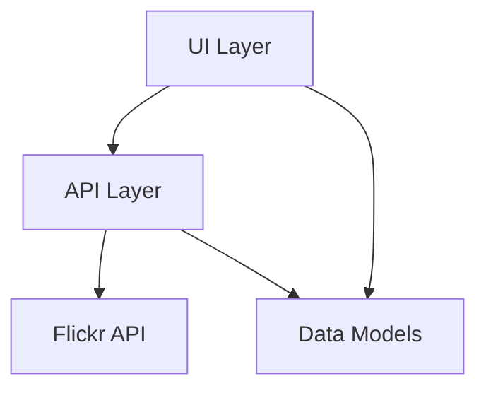
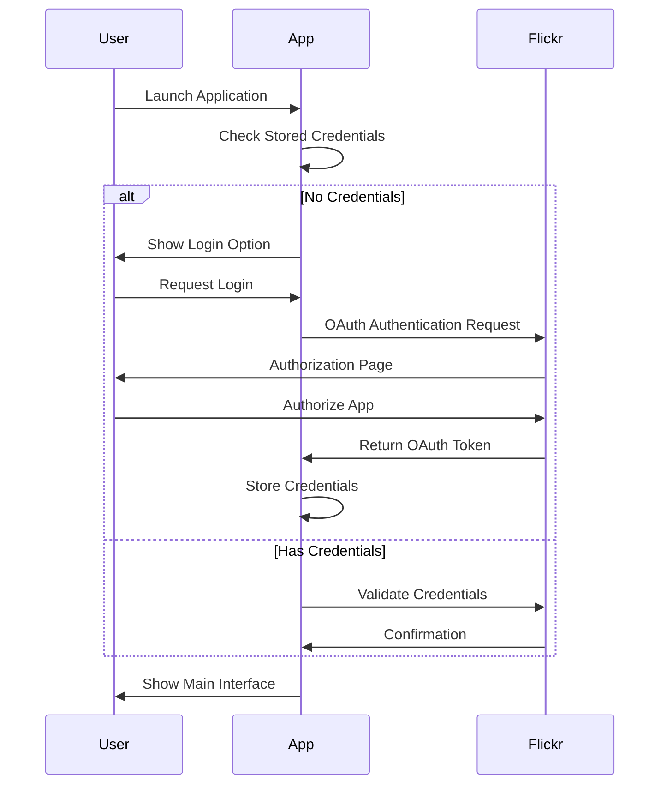
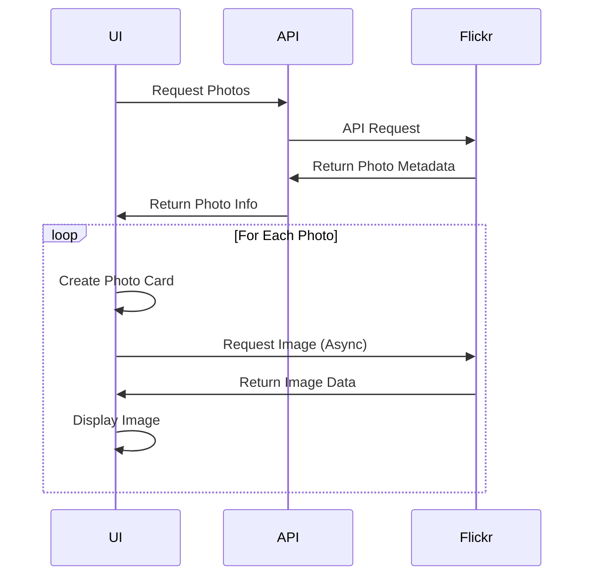
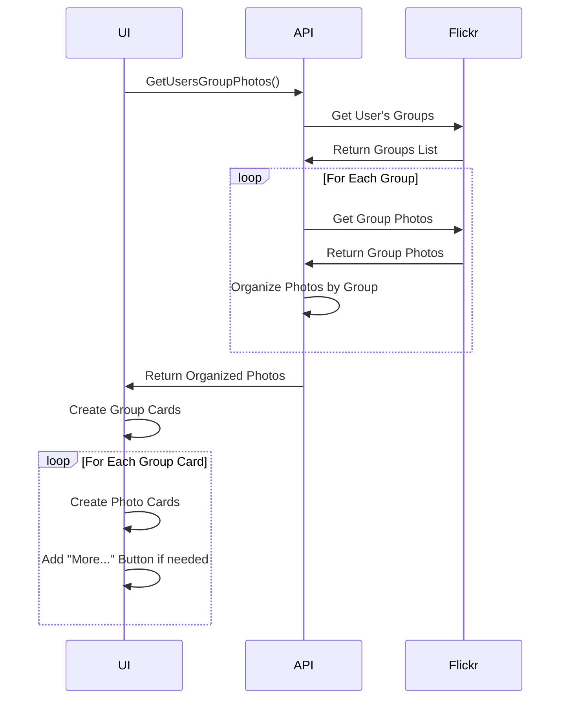
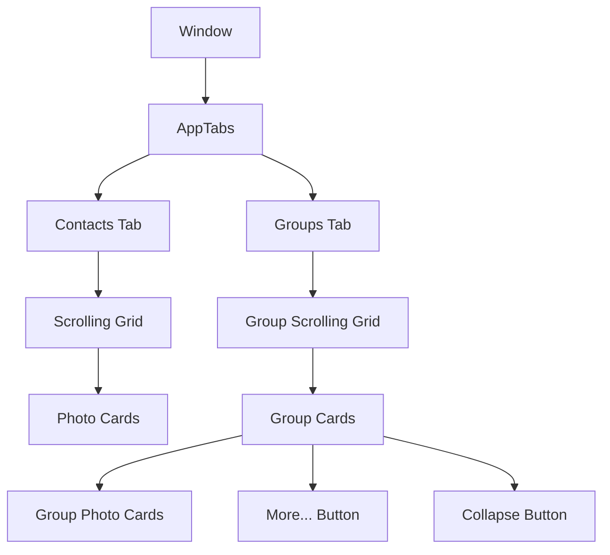
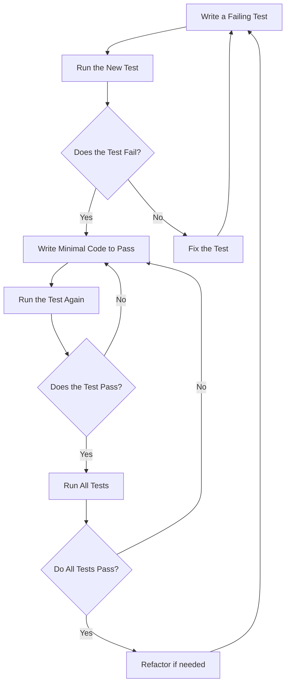

# System Patterns: Glimmer

## Architecture Overview

Glimmer follows a clean architecture with clear separation of concerns between different layers:

### Layers

1. **UI Layer** (`ui` package): Manages all user interface components and interactions
2. **API Layer** (`api` package): Handles communication with the Flickr API
3. **Data Models**: Represent Flickr entities (Photos, Contacts, Groups)

## Key Design Patterns

### Model-View Pattern
The application follows a Model-View pattern where:
- Models represent data from Flickr (photos, contacts, groups)
- Views display the data and handle user interactions

### Asynchronous Processing
- Background operations for API calls and image loading
- Channel-based concurrency control for image loading
- Semaphore pattern for limiting concurrent image downloads

### Component-Based UI
- Reusable UI components (cards, tabs, containers)
- Composition over inheritance for UI elements
- Event-driven interactions

## Critical Implementation Paths

### Authentication Flow

### Photo Loading Process

### Group Photos Loading

## Component Relationships

### Application Structure
- `myApp`: Core application structure that manages the window, client, and UI components
- `apptabs`: Manages the tabbed interface for navigating between contacts and groups
- `contactPhotos`: Handles the display and loading of contact photos
- `groupPhotosUI`: Manages the display of group photos organized by group

### UI Component Hierarchy

## Testing Strategy

The project follows Test-Driven Development (TDD) with a focus on:

1. **Unit Tests**: Testing individual components and functions
2. **Mock Implementations**: Using mock HTTP clients and responses for testing API interactions
3. **UI Component Tests**: Verifying UI components render and behave correctly

