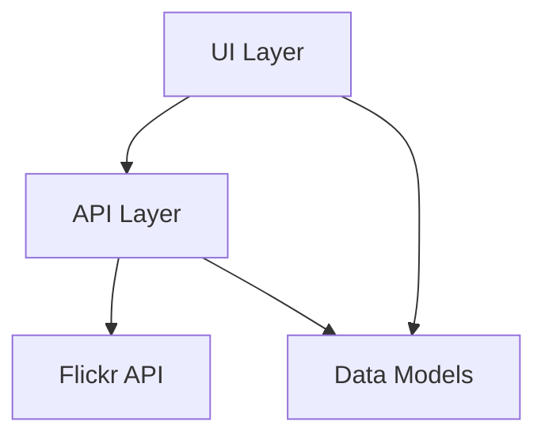
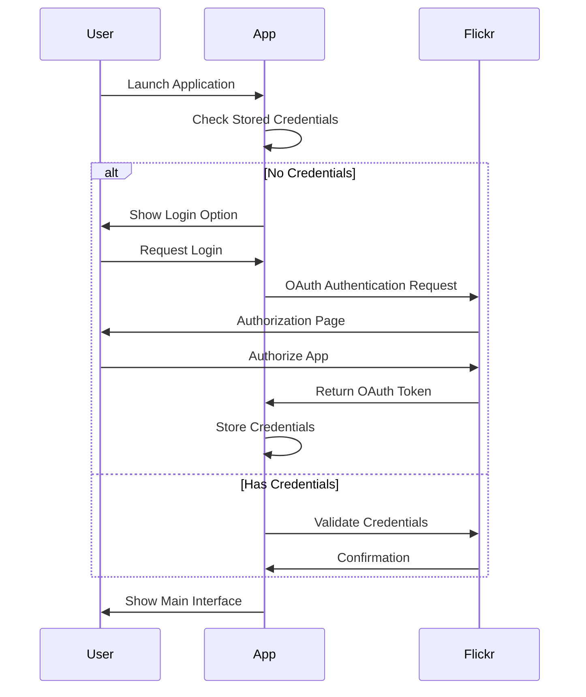
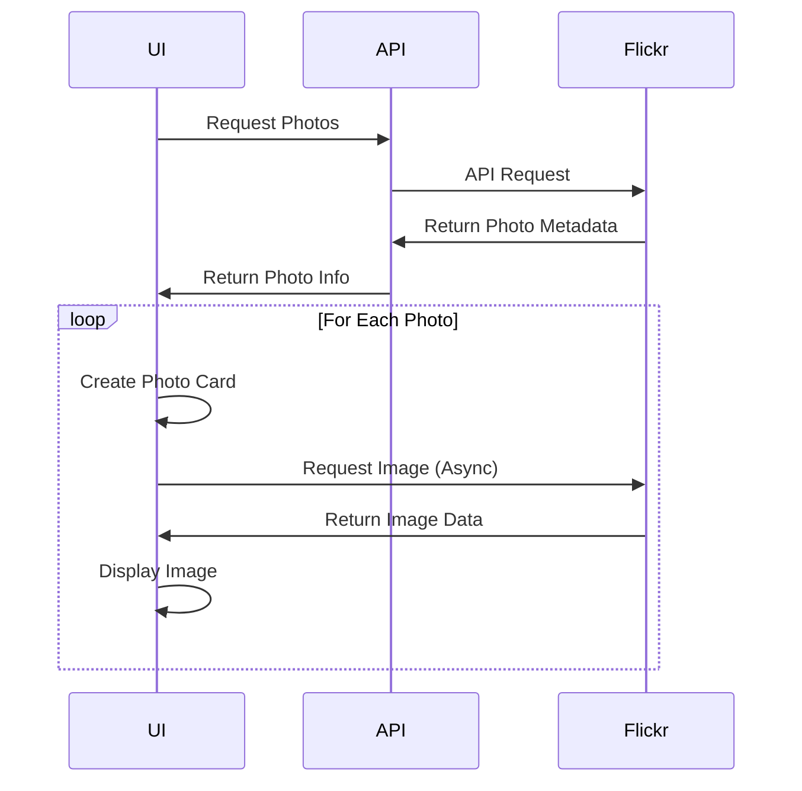
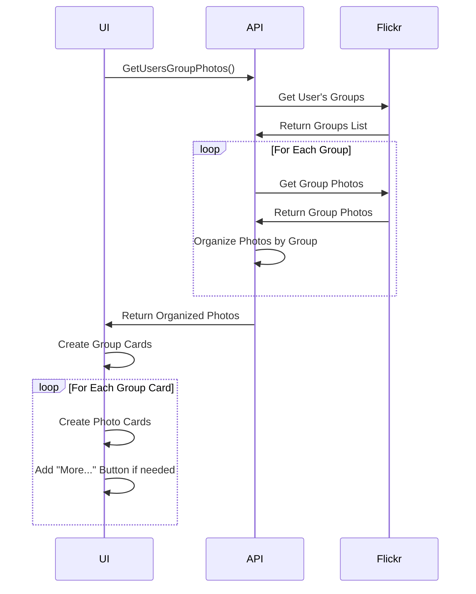
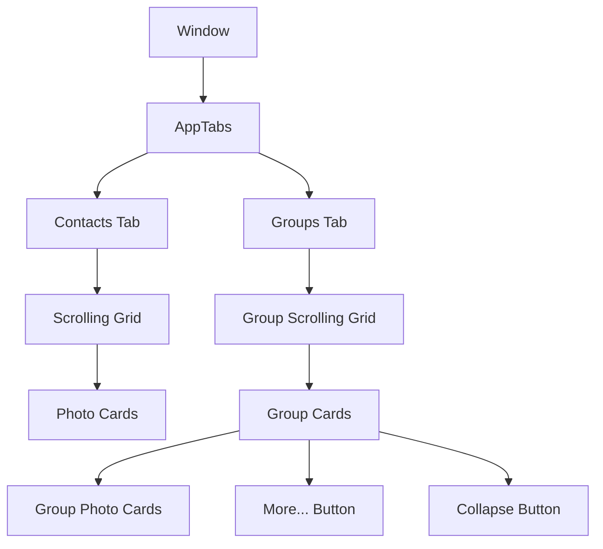
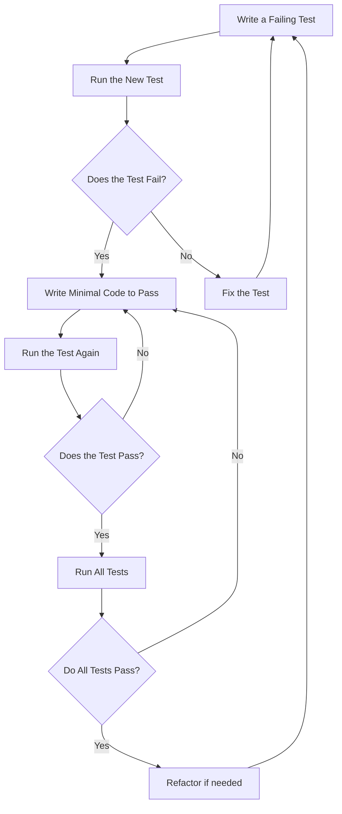

# System Patterns: Glimmer

## Architecture Overview

Glimmer follows a clean architecture with clear separation of concerns between different layers:

```mermaid
graph TD
    UI[UI Layer] --> API[API Layer]
    API --> Flickr[Flickr API]
    UI --> Models[Data Models]
    API --> Models
```

### Layers

1. **UI Layer** (`ui` package): Manages all user interface components and interactions
2. **API Layer** (`api` package): Handles communication with the Flickr API
3. **Data Models**: Represent Flickr entities (Photos, Contacts, Groups)

## Key Design Patterns

### Model-View Pattern
The application follows a Model-View pattern where:
- Models represent data from Flickr (photos, contacts, groups)
- Views display the data and handle user interactions

### Asynchronous Processing
- Background operations for API calls and image loading
- Channel-based concurrency control for image loading
- Semaphore pattern for limiting concurrent image downloads

### Component-Based UI
- Reusable UI components (cards, tabs, containers)
- Composition over inheritance for UI elements
- Event-driven interactions

## Critical Implementation Paths

### Authentication Flow

```mermaid
sequenceDiagram
    participant User
    participant App
    participant Flickr

    User->>App: Launch Application
    App->>App: Check Stored Credentials
    alt No Credentials
        App->>User: Show Login Option
        User->>App: Request Login
        App->>Flickr: OAuth Authentication Request
        Flickr->>User: Authorization Page
        User->>Flickr: Authorize App
        Flickr->>App: Return OAuth Token
        App->>App: Store Credentials
    else Has Credentials
        App->>Flickr: Validate Credentials
        Flickr->>App: Confirmation
    end
    App->>User: Show Main Interface
```

### Photo Loading Process

```mermaid
sequenceDiagram
    participant UI
    participant API
    participant Flickr

    UI->>API: Request Photos
    API->>Flickr: API Request
    Flickr->>API: Return Photo Metadata
    API->>UI: Return Photo Info

    loop For Each Photo
        UI->>UI: Create Photo Card
        UI->>Flickr: Request Image (Async)
        Flickr->>UI: Return Image Data
        UI->>UI: Display Image
    end
```

### Group Photos Loading

```mermaid
sequenceDiagram
    participant UI
    participant API
    participant Flickr

    UI->>API: GetUsersGroupPhotos()
    API->>Flickr: Get User's Groups
    Flickr->>API: Return Groups List

    loop For Each Group
        API->>Flickr: Get Group Photos
        Flickr->>API: Return Group Photos
        API->>API: Organize Photos by Group
    end

    API->>UI: Return Organized Photos
    UI->>UI: Create Group Cards

    loop For Each Group Card
        UI->>UI: Create Photo Cards
        UI->>UI: Add "More..." Button if needed
    end
```

## Component Relationships

### Application Structure
- `myApp`: Core application structure that manages the window, client, and UI components
- `apptabs`: Manages the tabbed interface for navigating between contacts and groups
- `contactPhotos`: Handles the display and loading of contact photos
- `groupPhotosUI`: Manages the display of group photos organized by group

### UI Component Hierarchy

```mermaid
graph TD
    Window[Window] --> AppTabs[AppTabs]
    AppTabs --> ContactsTab[Contacts Tab]
    AppTabs --> GroupsTab[Groups Tab]

    ContactsTab --> ScrollingGrid[Scrolling Grid]
    ScrollingGrid --> PhotoCards[Photo Cards]

    GroupsTab --> GroupScrollingGrid[Group Scrolling Grid]
    GroupScrollingGrid --> GroupCards[Group Cards]
    GroupCards --> GroupPhotoCards[Group Photo Cards]
    GroupCards --> MoreButton[More... Button]
    GroupCards --> CollapseButton[Collapse Button]
```

## Testing Strategy

The project follows Test-Driven Development (TDD) with a focus on:

1. **Unit Tests**: Testing individual components and functions
2. **Mock Implementations**: Using mock HTTP clients and responses for testing API interactions
3. **UI Component Tests**: Verifying UI components render and behave correctly

```mermaid
graph TD
    Write[Write a Failing Test] --> Run[Run the New Test]
    Run --> Check{Does the Test Fail?}
    Check -->|Yes| Code[Write Minimal Code to Pass]
    Code --> RunAgain[Run the Test Again]
    RunAgain --> Pass{Does the Test Pass?}
    Pass -->|Yes| RunAll[Run All Tests]
    RunAll --> AllPass{Do All Tests Pass?}
    AllPass -->|Yes| Refactor[Refactor if needed]
    Refactor --> Write
    AllPass -->|No| Code
    Pass -->|No| Code
    Check -->|No| Fix[Fix the Test]
    Fix --> Write
```

## ⚠️ STRICT TEST-DRIVEN DEVELOPMENT (TDD) WORKFLOW ⚠️

This project follows **Test-Driven Development (TDD)** with ZERO exceptions. Follow this workflow precisely:

### TDD Cycle - The Only Acceptable Process

1. **RED:** Write a failing test first
   - Write only the test code
   - Do not write or suggest any production code
   - Do not even hint at implementation details

2. **CONFIRMATION:** Wait for test failure confirmation
   - The test must be run and confirmed to fail
   - Understand why it fails before proceeding

3. **GREEN:** Only after confirmed failure, write minimal production code
   - Write only enough code to make the test pass
   - Focus on simplicity, not perfection

4. **REFACTOR:** Only after the test passes, consider refactoring
   - Improve the code without changing behavior
   - All tests must still pass after refactoring

### Critical Rules - No Exceptions

- **✋ NEVER suggest production code before a failing test exists and is confirmed**
- **✋ NEVER combine test and implementation in the same step**
- **✋ NEVER skip the confirmation of test failure**
- **✋ NEVER write more implementation than needed to pass the current test**
- **✋ NEVER plan multiple steps ahead - focus only on the current failing test**

### Process Flow - Follow Exactly

1. Write a single failing test for one specific behavior
2. Wait for me to implement and run the test
3. Wait for me to confirm the test fails
4. Only then, write minimal code to make the test pass
5. Wait for me to implement and confirm the test passes
6. Suggest refactoring if needed
7. Repeat from step 1 for the next behavior

## Coding Style

- All code must be idiomatic go code
- All code should be commented for go-doc
- Before accepting any code, format it using `go fmt`
- Prefer the testify unit test framework
