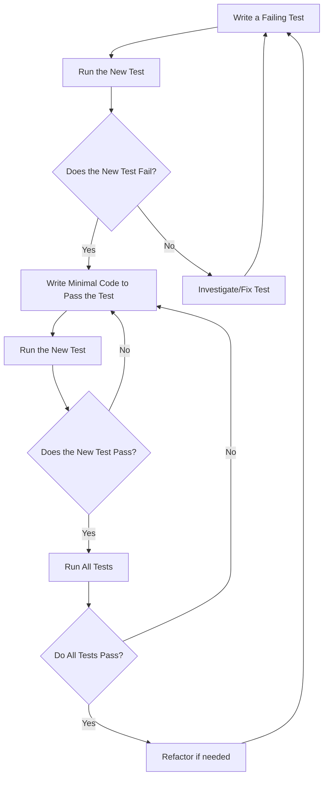

```mermaid
graph TD
    A[Write a Failing Test] --> B[Run the New Test];
    B --> C{Does the New Test Fail?};
    C -- Yes --> D[Write Minimal Code to Pass the Test];
    D --> E[Run the New Test];
    E --> F{Does the New Test Pass?};
    F -- Yes --> G[Run All Tests];
    G --> H{Do All Tests Pass?};
    H -- Yes --> I[Refactor if needed];
    I --> A;
    H -- No --> D;
    F -- No --> D;
    C -- No --> J[Investigate/Fix Test];
    J --> A;
```
